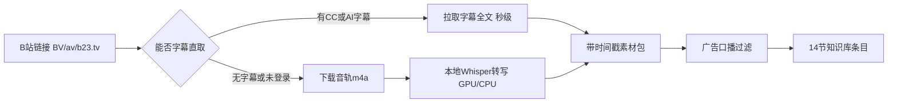

<div align="center">

# bilibili-video-summary

[](https://github.com/Willson-Huang/bilibili-video-summary/releases/latest)
[](LICENSE)
[](https://www.python.org/)
[](https://github.com/Willson-Huang/bilibili-video-summary/stargazers)

**把 B站视频，变成半年后还能搜到的知识笔记。**

本地 Whisper 离线转写（GPU 加速）→ 基于全文（而非标题简介）→ 固定 14 节结构化 Markdown 条目。

**EN** — Turn a Bilibili video into a knowledge note you can still search six months later: local Whisper transcription (offline, GPU-accelerated) plus a fixed 14-section Markdown template with timestamps, entity tables and a claims-to-verify list.

[Releases](https://github.com/Willson-Huang/bilibili-video-summary/releases/latest) · [真实输出示例](examples/2025-07-25_哲学知识分享——熵增与熵减_荣格不吃炸鸡_纪要.md) · [快速开始](#-快速开始三选一) · [FAQ](#-faq)

</div>

---

## 为什么做这个

听 1 小时播客要花 1 小时；让 AI「总结这个视频」，它只会看标题和简介——**它根本没看过视频**。

这个工具把音轨拉下来，用本地 Whisper 转写成**带时间戳的全文**，再基于全文产出 14 节知识条目：每条结论可回跳时间点，每个存疑处标注 `[原文疑似]`，转写数据不出你的电脑。

| ⏱️ 实测性能（RTX 4060 Ti） | |
|---|---|
| 2 分 24 秒视频 → 拿到全文转写 | **12 秒**（下载 2.0s + 转写 8.8s） |
| 1 小时视频推算 | **约 3 分钟**（large-v3-turbo @ CUDA） |
| 4 分 48 秒完成 1:39:28 长视频实测 | **24.6x 实时** |
| 播放视频？上传数据？ | 不需要 · 不上传 |

> 上表为真实运行记录（`BV1habQzWEzq`，turbo @ CUDA，模型已缓存）。**首次运行**会额外下载 Whisper 模型（约 1.5 GB，一次性的），之后走本地缓存。

## 它是怎么工作的



> 图中的「字幕直取」指配置 B站 Cookie 后直接拉取官方 CC/AI 字幕（秒级）；无字幕或未配置 Cookie 时自动降级为本地 Whisper 转写，音轨下载后不转码、转写完即删。

## 🚀 快速开始（三选一）

<details open>
<summary><b>🤖 我是 Claude / Cursor / ChatGPT 用户（最常见）</b></summary>

1. 下载并解压 [便携版 zip](https://github.com/Willson-Huang/bilibili-video-summary/releases/latest)（或 `git clone` 本仓库）
2. 安装依赖：`pip install -r portable/requirements.txt`
3. 把 `portable/SKILL.md` **全文**作为指令导入：Claude Projects / Cursor Rules / GPTs Instructions
4. 之后对 AI 说：*「总结这个视频 https://www.bilibili.com/video/BVxxxx」* 即可

</details>

<details>
<summary><b>🛠️ 我是 WorkBuddy 用户（一键安装）</b></summary>

1. 下载 [WorkBuddy 版 zip](https://github.com/Willson-Huang/bilibili-video-summary/releases/latest)
2. 解压，把 `bilibili-video-summary/` **整个文件夹**放进 `~/.workbuddy/skills/`
3. 重启 WorkBuddy，直接发 B站链接
4. 首次使用前装转写环境：`pip install faster-whisper yt-dlp imageio-ffmpeg`（详见 Release Notes）

</details>

<details>
<summary><b>👨‍💻 我只想用脚本，不接 AI 平台</b></summary>

```bash
git clone https://github.com/Willson-Huang/bilibili-video-summary.git
cd bilibili-video-summary/portable
pip install -r requirements.txt

# 转写一个视频（首次运行会自动下载 Whisper 模型）
python scripts/bili_asr.py "https://www.bilibili.com/video/BVxxxx" --out 素材包/demo.md

# 自测环境（不联网、不需要模型）
python tests/test_core.py
```

</details>

## 📄 输出长什么样

一段 2 分 24 秒的科普短视频（《熵增与熵减》），完整真实产出见
[examples/2025-07-25_哲学知识分享——熵增与熵减_荣格不吃炸鸡_纪要.md](examples/2025-07-25_哲学知识分享——熵增与熵减_荣格不吃炸鸡_纪要.md)：

> **版权说明**：示例纪要基于上述 UP主的公开视频由本工具自动整理，仅供演示输出格式与个人学习使用；视频内容及音轨版权归原 UP主所有。如权利人要求删除或调整，请提 [Issue](https://github.com/Willson-Huang/bilibili-video-summary/issues) 或联系仓库所有者，将在 24 小时内处理。

<details>
<summary><b>点开看真实产出片段</b></summary>

**核心结论**：熵增是孤立系统自发走向混乱的物理铁律，而生命通过持续汲取能量维持自身秩序，是对抗熵增的"熵减堡垒"。

| 时间 | 要点 |
|---|---|
| 00:00:26 | 热力学第二定律：孤立系统自发从有序走向无序（冰块融化 / 墨水扩散 / 快递拆封） |
| 00:00:48 | 熵减必须消耗外部能量：整理房间对抗混乱 |
| 00:01:07 | 生命体靠汲取能量维持有序，是"对抗熵增的堡垒" |

**术语表**（编者补充以增强检索）：熵 / 熵增定律 / 耗散结构 / 负熵……

**诚实标注 ASR 误识**——转写把「熵增」识别成「伤增」、「无序」识别成「无需」。
所有存疑处都标 `[原文疑似]` 并记录在条目的「信息完整性」章节，而不是假装正确：

| 转写原文 | 应为 |
|---|---|
| 伤增 | 熵增 |
| 无需洪流 | 无序洪流 |
| 商简之火 | 熵减之火 |

</details>

## 📦 下载安装 / Download & Install

不想用 git？直接从 [**Releases**](https://github.com/Willson-Huang/bilibili-video-summary/releases/latest) 下载打包好的安装包：

| 资产 | 用途 |
|---|---|
| `bilibili-video-summary-workbuddy-vX.Y.Z.zip` | 解压后把 `bilibili-video-summary/` 整个放进 `~/.workbuddy/skills/`，重启 WorkBuddy 即完成安装 |
| `bilibili-video-summary-portable-vX.Y.Z.zip` | 解压到任意位置，把 `SKILL.md` 作为指令导入你的 AI 平台 |
| `checksums.txt` | 各资产 SHA-256，下载后建议核对 |

## 🆕 v2.5.1 更新（2026-09-10）

- 🧠 **双引擎路由**：新增 **Fun-ASR-Nano** 支持，专治中文专名同音误识——实测专名正确率 **10/11 vs whisper 2/11**（"隐性债务"whisper 错成"险性债务"×5，Nano 全对）。`--classify` 按 UP主白名单 → 视频 tag → 关键词打分给出引擎建议
- 📕 **专名纠错表**：新增 `references/asr_glossary.txt`（机器可读的 `误识 | 正确 | 语境限定`）+ `check_glossary.py` 兜底复核，拦截"看起来没毛病的合法中文词"类误识
- 🔁 **自学习白名单**：`references/engine_up_whitelist.txt` + `engine_verify_log.txt`——UP主 → 引擎的映射可增量维护，判错留痕可追溯（本仓库只提供**模板**与维护规则，不含个人观看清单）
- 🐛 修复：`requested_downloads` 为空列表时索引崩溃；批量队列不再清空用户手写备注
- 🧩 重构：WBI 签名逻辑统一到 `bili_wbi.py`，路径全部改为 `__file__` / 环境变量派生（可迁移、可便携部署）
- ⚖️ **合规**：撤下第三方"B站非公开接口文档"映射表（该上游因**律师函**已关停），改为只依赖公开 tag 接口

完整变更见 [Release Notes](https://github.com/Willson-Huang/bilibili-video-summary/releases/tag/v2.5.1)。历史版本见 v2.2.0 / v2.1.0。

## ❓ FAQ

<details>
<summary>需要 B站账号 / Cookie 吗？</summary>

不需要。不配 Cookie 也能下载音轨并转写；配置 Cookie（`SESSDATA`）后可解锁 CC/AI 字幕直取（秒级，不用转写）。

</details>

<details>
<summary>没有 NVIDIA GPU 能用吗？</summary>

能。脚本自动回退 CPU（int8），速度约为 GPU 的 1/6——1 小时视频约 9–10 分钟。有 N 卡就装 `nvidia-*` 包，自动启用 CUDA。

</details>

<details>
<summary>和「AI 直接总结视频链接」有什么区别？</summary>

AI 平台看不到视频内容，只能基于标题/简介/评论猜。本工具把<b>带时间戳的全文转写</b>喂给 AI：总结基于真实内容，每条结论都能回跳到视频时间点，还能按你的知识库格式归档。

</details>

<details>
<summary>支持哪些链接格式？</summary>

`bilibili.com/video/BVxx`、`b23.tv` 短链、`av` 号、`?p=N` 分P。多个链接可走本地 CSV 队列批量处理（`process_queue.py`）。

</details>

## 🔒 隐私：数据不出本机

- 音轨下载、Whisper 转写、纪要生成**全程在本地完成**，无任何云端调用；Whisper 模型从 HuggingFace 镜像一次性下载后离线使用
- B站登录 Cookie 只存本地文件（`~/.cache/bilibili-video-summary/.bilibili_cookie`），已被 `.gitignore` 排除，**永远不会进仓库**
- 本仓库发布前做过脱敏审计：无绝对路径、无私有资源 ID、无真实用户数据；脚本与文档中的敏感值全部改为环境变量（`BILI_PYTHON` / `BILI_CACHE` / `BILI_COOKIE` 等）

## 两个版本

| 目录 | 适用场景 | 依赖 |
|---|---|---|
| [`workbuddy/`](./workbuddy) | 在 **WorkBuddy** 里使用，保留「资料库在线表」队列 + IMA 知识库归档 | WorkBuddy 运行时、IMA MCP |
| [`portable/`](./portable) | 装到 **Claude / Cursor / ChatGPT 自定义 GPT** 等任意 AI 平台 | 仅标准 Python/Node + `faster-whisper`/`yt-dlp`/`imageio-ffmpeg` |

## 目录结构

```
bilibili-video-summary/
├── examples/            # 真实产出示例（本工具自己生成的 14 节纪要）
├── workbuddy/           # WorkBuddy 原版（SKILL.md + scripts + references + tests）
└── portable/            # 便携版（无平台依赖）
    ├── SKILL.md         # 完整指令——导入 AI 平台的就是它
    ├── requirements.txt
    ├── scripts/         # bili_asr.py / process_queue.py / bili.mjs / bili_wbi.py|mjs ...
    │                    #   funasr_adapter.py 第二引擎（Fun-ASR-Nano）适配层
    │                    #   check_glossary.py 专名纠错复核 · verify_structure.py 结构校验
    │                    #   verify_coverage.py 覆盖校验 · chrome_cookie_export.py Cookie 导出
    ├── references/      # 知识条目模板 / 广告过滤词表
    │                    #   asr_glossary.txt 专名误识对照表
    │                    #   engine_up_whitelist.txt + engine_verify_log.txt（模板）
    └── tests/           # 纯本地自测（13 项断言）
```

## 注意事项

- 视频内容的版权归原作者所有；本工具仅作个人学习与知识整理用途，请勿批量抓取或分发他人内容
- **不得用于下载、绕过或分发付费 / 大会员专属内容**；配置 Cookie 仅用于访问你本人账号有权查看的内容（字幕直取 / 高码率音源）
- 公开发布由本工具生成的条目时，请附视频链接与版权归属说明（模板「使用规则」已内置此要求）
- 模型缓存：`~/.cache/bilibili-video-summary/models/whisper`（便携版）或 `~/.workbuddy/models/whisper`（WorkBuddy 版）
- 转写是口播内容，含口语重复与 ASR 错字；产出中疑问处一律标注 `[原文疑似]`

---

<div align="center">

如果这个工具帮你省下了刷视频的时间，欢迎点个 ⭐ —— 对一个刚出生的仓库很重要。

**MIT License** · 由 [@Willson-Huang](https://github.com/Willson-Huang) 为自己的 Obsidian 知识库而造，发布前已完成隐私脱敏与本地自测

</div>
