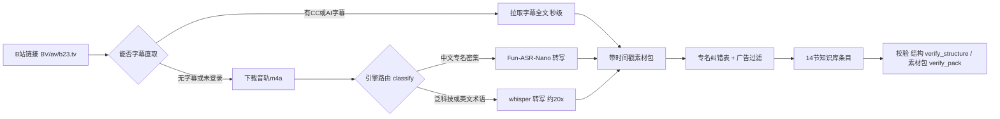
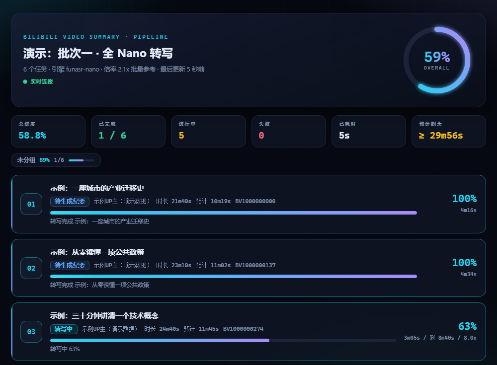

<div align="center">

# bilibili-video-summary

[](https://github.com/Willson-Huang/bilibili-video-summary/releases/latest)
[](https://github.com/Willson-Huang/bilibili-video-summary/actions/workflows/test.yml)
[](LICENSE)
[](https://www.python.org/)
[](https://github.com/Willson-Huang/bilibili-video-summary/stargazers)

**把 B站视频，变成半年后还能搜到的知识笔记。**

字幕直取（秒级）或本地双引擎转写（whisper 快约 20 倍 / Fun-ASR-Nano 中文专名更准）→ 专名纠错 + 广告过滤 → 固定 14 节结构化条目，经结构校验与素材包校验后交付。

**EN** — Turn a Bilibili video into a knowledge note you can still search six months later: official subtitles in seconds, or local dual-engine ASR (whisper ≈20× faster, Fun-ASR-Nano far better on Chinese proper nouns), then proper-noun correction + ad filtering, and finally a fixed 14-section Markdown entry that must pass structure and pack validation.

[Releases](https://github.com/Willson-Huang/bilibili-video-summary/releases/latest) · [避坑经验](#避坑经验先看这个能省你几天) · [更新日志](#更新日志最新在上) · [为什么做这个](#为什么做这个) · [它是怎么工作的](#它是怎么工作的) · [进度看板](#进度看板mission-control) · [快速开始](#快速开始三选一) · [输出长什么样](#输出长什么样) · [真实输出示例](examples/2025-07-25_哲学知识分享——熵增与熵减_荣格不吃炸鸡_纪要.md) · [FAQ](#faq) · [隐私与数据流向](#隐私与数据流向) · [两个版本](#两个版本) · [升级与清理](#升级与清理) · [目录结构](#目录结构) · [注意事项](#注意事项)

</div>

---

## 避坑经验（先看这个，能省你几天）

> 完整数据、逐条实测与复现命令见 [`docs/避坑经验.md`](docs/避坑经验.md)；AI 字幕机制的实证过程与原始数据见 [`docs/B站AI字幕机制验证-2026-09-19.md`](docs/B站AI字幕机制验证-2026-09-19.md)。
>
> 其中与平台无关的部分（ASR 引擎选型、已否决的路线、校对方法论）已独立成库：[**chinese-asr-notes**](https://github.com/Willson-Huang/chinese-asr-notes)。不做 B站 也可以直接看那边，那边更全。

省时间的五条：

1. **B站 AI 字幕（`ai-zh`）是原声中文 ASR 轨**（实测见 [`docs/B站AI字幕机制验证-2026-09-19.md`](docs/B站AI字幕机制验证-2026-09-19.md)）。它**正文级可信**（与画面内嵌人工字幕 8/8 语义吻合、数字换算正确），但**专名级不稳** —— 同一专名片内能错 2 次（`草料哥 → 长廖哥`），还有**双引擎共同错**（品牌 `大宝荐`：AI 字幕写「大保健」、whisper 写「大宝剑」，正确写法只能从同季集名反查）。只有人工 CC（`zh-CN`）可作基准，专名密集的内容一律加 `--force-asr --engine funasr-nano`
2. **两个引擎的专名差距是 5 倍**：whisper-large-v3-turbo 专名 2/11，Fun-ASR-Nano 10/11，代价是慢约 4 倍（19.2x 对 5.1x 实时）。⚠️ whisper 的错可能是高置信度错（肇庆 → 赵庆），别只看置信度
3. **大量看起来该有用的路线已被真实数据否决**：专名候选表覆盖 5.0%、确定性规则层真实可修 2.1%、片内一致性收益 2.3%、词表跨主题精度 0/3。别重跑，每条都附了数据
4. **校对靠按类型核查，查词表基本无效**：同一份素材包，词表法 0 个真阳性，按类型核查（企业名 → 地名 → 历史地名）3 个真错写。最危险的是错写本身仍是合法中文词（`姚顺雨` 被反复误识为 `尧舜禹`，一路进元数据，把检索入口堵住）
5. **素材包是误识修正的唯一依据**：曾因收尾流程删掉 32 份、只能重跑一遍；现改为归档保留（`cache/bili_subs/`），归档前有 `verify_pack` 拦截。另外注意目录里存在 `sub_BV*` 与 `bili_BV*` 两种前缀

> 再加一条只看时长就能省时间的规律：**字幕轨有无与「充电专属」无关，只跟时长相关** —— ≤20min 短片带 6 语（zh/en/ja/es/ar/pt）AI 字幕，≥50min 长片一律无轨（实测 5 例全空）。≥50min 直接按「无字幕、必走 ASR」排期，不必浪费接口调用去探测。

> 其余坑（Cookie 自动化三条路全断、元信息不能进回归基线、单测全绿不等于判据正确、长任务恢复看磁盘不信汇报…）见上面两个链接。

---

<!-- ══════════════════════════════════════════════════════════════════════
     维护规则（改动本区块前必读）
     1. 本区块**只放版本索引表**，新版本在表的最上方加一行（版本 · 日期 · 主题）
     2. 条目明细写进 `docs/更新日志.md` 的**最上方**；历史条目只增不删
     3. 每个版本在两处各加一条：本表一行 + 更新日志一条
     ══════════════════════════════════════════════════════════════════════ -->

## 更新日志（最新在上）

| 版本 | 日期 | 主题 |
|---|---|---|
| **[v2.7.1](https://github.com/Willson-Huang/bilibili-video-summary/releases/tag/v2.7.1)** | 2026-09-28 | 自测在非 UTC+8 的机器上不再误报失败 · 补上 CI（2 构建 × Windows/Linux） |
| [v2.7.0](https://github.com/Willson-Huang/bilibili-video-summary/releases/tag/v2.7.0) | 2026-09-27 | 看板的数字都有依据（预计剩余三档倍率）· 阶段模型补齐（转写完成≠任务完成）· 队列与台账的静默失败修复 |
| [v2.6.9](https://github.com/Willson-Huang/bilibili-video-summary/releases/tag/v2.6.9) | 2026-09-24 | 校验输出改走文件 · 子代理中间文件位置约束 · 派发后主线程不空等 · 维护与记账规则 |
| [v2.6.8](https://github.com/Willson-Huang/bilibili-video-summary/releases/tag/v2.6.8) | 2026-09-19 | 修复 `--prompt` 泄漏成正文 · 便携版补齐实测坑 · AI 字幕口径全仓订正 |
| [v2.6.7](https://github.com/Willson-Huang/bilibili-video-summary/releases/tag/v2.6.7) | 2026-09-19 | 进度看板上报默认开启 · AI 字幕定性订正 · 多语种与批量排期实测回流 |
| [v2.6.6](https://github.com/Willson-Huang/bilibili-video-summary/releases/tag/v2.6.6) | 2026-09-16 | 素材包校验与自描述 · 不可信输入防御 · 查重语义收敛（含 v2.6.1–v2.6.5 的迭代） |
| [v2.6.0](https://github.com/Willson-Huang/bilibili-video-summary/releases/tag/v2.6.0) | 2026-09-16 | 进度看板子系统（零依赖独立窗口）· 引擎速度基准 · 队列 `--force-asr` 透传 |
| [v2.5.2](https://github.com/Willson-Huang/bilibili-video-summary/releases/tag/v2.5.2) | 2026-09-10 | 文档修正：AI 字幕经回译、专名不可信（含路由与验证基准的使用边界） |
| [v2.5.1](https://github.com/Willson-Huang/bilibili-video-summary/releases/tag/v2.5.1) | 2026-09-10 | 双引擎路由（whisper ↔ Fun-ASR-Nano）· 专名纠错表 · 白名单自学习 |
| [v2.2.0](https://github.com/Willson-Huang/bilibili-video-summary/releases/tag/v2.2.0) | 2026-09-05 | 结构校验 · Cookie 自动导出 · 队列按 UP主 过滤 · 合规加固 |
| [v2.1.0](https://github.com/Willson-Huang/bilibili-video-summary/releases/tag/v2.1.0) | 2026-08-30 | 首次发布：WorkBuddy 原版 + 跨平台便携版 |

条目明细见 [`docs/更新日志.md`](docs/更新日志.md)；各版本的正式说明另见 [Releases](https://github.com/Willson-Huang/bilibili-video-summary/releases)。


---

## 为什么做这个

听 1 小时播客要花 1 小时。直接让 AI「总结这个视频」，它只能看标题和简介，因为它根本没有看过视频。

这个工具把音轨拉下来，用本地双引擎（whisper / Fun-ASR-Nano）转写成带时间戳的全文，再基于全文产出 14 节知识条目：每条结论都能回跳到时间点，每个存疑处标注 `[原文疑似]`，素材包全程不出你的电脑。

| 实测性能（NVIDIA RTX 4060 Ti 8GB） | |
|---|---|
| `whisper-large-v3-turbo` | **19.2x 实时**（1483s 音频转 77.4s），1 小时视频约 3 分钟；1:39:28 长视频实测转写 243s |
| `Fun-ASR-Nano`（中文专名更准，见下） | **5.1x 实时**，排期按 5x 算，10 小时音频约 2 小时（冷启动 48–52s，批量只付一次） |
| 2 分 24 秒视频 → 拿到全文转写 | **12 秒**（下载 2.0s + 转写 8.8s，模型已缓存） |
| 播放视频？上传数据？ | 无需播放；素材包不出本机（纪要副本可选上传到你自己的知识库） |

> 上表的两个倍率来自 1483s 对照样本（原始数据见 `portable/references/perf-benchmark-2026-09-13.md`），「2 分 24 秒 → 12 秒」一行与 1:39:28 那一行分别来自示例视频 `BV1habQzWEzq` 与一次长视频实跑；均为 turbo @ CUDA、模型已缓存。首次运行会额外下载 Whisper 模型（约 1.5 GB，一次性的），之后走本地缓存；Fun-ASR-Nano 模型需另行下载。

## 它是怎么工作的


```mermaid
graph LR
    A["B站链接 BV/av/b23.tv"] --> B{"能否字幕直取"}
    B -->|有CC或AI字幕| C["拉取字幕全文 秒级"]
    B -->|无字幕或未登录| D["下载音轨m4a"]
    D --> E{"引擎路由 classify"}
    E -->|中文专名密集| F["Fun-ASR-Nano 转写"]
    E -->|泛科技或英文术语| G["whisper 转写 约20x"]
    C --> H["带时间戳素材包"]
    F --> H
    G --> H
    H --> I["专名纠错表 + 广告过滤"]
    I --> J["14节知识库条目"]
    J --> K["校验 结构 verify_structure / 素材包 verify_pack"]
```

**先约定几个词**：

| 叫法 | 指什么 |
|---|---|
| **素材包** | 带时间戳的转写全文（含元信息、章节、简介、字幕、热评），归档在本地 `cache/bili_subs/`。它同时是误识修正的唯一依据，所以不随收尾删除 |
| **字幕来源分级** | `zh-CN` 人工 CC（可信，可作核对基准）与 `ai-zh` B站 AI 生成（原声中文 ASR 轨：正文可用、专名不可信） |
| **14 节条目** | 最终交付的知识笔记：固定 14 个章节，含实体三张子表、要点表格、时间线、术语表、信息完整性 |
| **引擎路由** | 无字幕时用哪套 ASR 的判定顺序：UP主白名单 → 视频 tag → 关键词打分（`--classify` 可先看建议） |

**三条路径的差别**：

| 环节 | 说明 |
|---|---|
| **字幕直取** | 配置 B站 Cookie 后直接拉取字幕（秒级）；无字幕或未配置 Cookie 时自动降级为本地转写。音轨下载后不转码、转写完即删。⚠️ **「有字幕」不等于可信** —— 字幕按来源分级（`ai-zh` 正文可用、专名不可信，详见上方避坑经验），专名密集内容建议 `--force-asr` 走本地 `funasr-nano`。另注意 **≥50min 长片通常没有字幕轨**（与是否充电专属无关），按无字幕预估 |
| **引擎路由** | 无字幕时按 `UP主白名单 → 视频 tag → 关键词打分` 选引擎（`--only-meta --classify` 给出建议）：`whisper` 快约 20 倍，`Fun-ASR-Nano` 中文专名更准（实测 10/11 对 2/11）；灰区一律判 whisper |
| **纠错与校验** | `asr_glossary.txt` 强制纠正「看起来没毛病的合法中文词」类误识；纪要产出必须过 `verify_structure.py` 四项强制校验（frontmatter / tags·entities 数量 / 14 节齐全 / 要点表格化）；素材包在归档前还要过 `verify_pack.py` 五组校验，不合格就拒绝闭环 |

## 进度看板（Mission Control）

批量转写动辄几十分钟，这段时间看不到任何进展是最难熬的。v2.6.0 起内置一个零第三方依赖（stdlib only）的独立进度看板，不占用终端，也不会引入包依赖冲突：



```bash
# 启动（写入端由管线自动上报，无需手动喂数据）
python scripts/progress_hub.py --serve --port 8765 --dir <运行目录> --open
# Windows 可一键启动
scripts/bili_dashboard.bat [运行目录] [端口]
# 想先看外观：生成演示数据
python scripts/progress_hub.py --demo --dir <运行目录> && python scripts/progress_hub.py --serve --dir <运行目录> --open
```

| 设计要点 | 说明 |
|---|---|
| **每进程独立事件文件** | 各进程写自己的 `events_<pid>.jsonl`，**不抢锁、不会交错损坏**；进程崩溃只丢自己那一份 |
| **两类任务同框** | 转写与纪要进度都进同一个看板，可按任务组区分来源 |
| **失败看得见** | 失败计数、重试次数与事件流都在页面上，避免跑了一夜才发现有 3 条失败 |
| **阶段与预计剩余** | 阶段按 `排队 → 下载 → 转码 → 转写 → 待生成纪要 → 生成纪要 → 已完成` 依次推进；预计剩余只按有实测依据的阶段给（倍率取「本批实测 → 批量兜底 2.1x → 单条常量」三档，顶部标出来源），没有样本的阶段显示「—」；数据龄按**最后一条事件**算，停更即转黄、转红 |
| **独立窗口** | Windows 上叠加 `CREATE_BREAKAWAY_FROM_JOB` 逃出宿主 Job Object，流水线结束后看板仍存活 |

> ⚠️ 转写结束不再自动标记「已完成」：要让看板显示完整链路，需按所属版本的 SKILL.md（[便携版](./portable/SKILL.md) / [WorkBuddy 版](./workbuddy/SKILL.md)）在两个时点上报 —— 开始生成纪要发 `notes`，纪要写完发 `done`；不发则任务停在「待生成纪要」。

> 上图为 `--demo` 生成的中性演示数据（非真实视频）。

## 前置条件

| 项 | 要求 | 说明 |
|---|---|---|
| Python | 3.10+ | 转写与队列脚本；依赖 `pip install -r portable/requirements.txt` |
| Node | 18+（可选） | 只有想用 `scripts/bili.mjs` 这条「不装 Python」的入口时才需要，主流程用不到 |
| 显卡 | 可选 | 有 N 卡装 `nvidia-cublas-cu12` / `nvidia-cudnn-cu12` 启用 CUDA；不装自动回退 CPU |
| 磁盘 | 约 2 GB 起 | 首次运行会下载 whisper 模型（约 1.5 GB，一次性）；音频临时文件另有占用 |
| 系统 | Windows / macOS / Linux | `.bat` 面向 Windows，`.sh` 面向 Linux / macOS（Git Bash 下未实测） |

**首次运行会发生什么**：从 HuggingFace 拉取模型。当前**默认走镜像站**（`--hf-mirror`，可用 `--no-hf-mirror` 改回官方源）。如果依赖装上了却拉不到模型，按 [`portable/SKILL.md`](./portable/SKILL.md) 的环境变量表设置 `HF_ENDPOINT` / `HF_HUB_DISABLE_SYMLINKS` / `HF_HUB_DISABLE_XET`，并**清空 `PYTHONPATH`**（部分 AI 平台会注入 shim 拦截文件删除，导致装包与模型下载失败）。

装完先跑自测确认环境（不联网、不需要模型）：

```bash
python portable/tests/test_core.py        # 纯 Python 自测
node portable/tests/test_dashboard_times.js   # 看板前端回归（需要 Node）
```

## 快速开始（三选一）

不想用 git？直接从 [**Releases**](https://github.com/Willson-Huang/bilibili-video-summary/releases/latest) 下载打包好的 zip（含 `checksums.txt`，下载后建议核对 SHA-256）。

<details open>
<summary><b>Claude / Cursor / ChatGPT 用户（最常见）</b></summary>

1. 下载并解压 [便携版 zip](https://github.com/Willson-Huang/bilibili-video-summary/releases/latest)（或 `git clone` 本仓库）
2. 安装依赖：`pip install -r portable/requirements.txt`
3. 把 [`portable/SKILL.md`](./portable/SKILL.md) **全文**作为指令导入：Claude Projects / Cursor Rules / GPTs Instructions
4. 之后对 AI 说：「总结这个视频 https://www.bilibili.com/video/BVxxxx」即可
5. 想用中文专名更强的 **Fun-ASR-Nano**（可选）：见 [`portable/SKILL.md`](./portable/SKILL.md) 的「第二引擎」安装说明。它跑在**独立的 venv** 里（`funasr` 与 `faster-whisper` 依赖冲突，**不能装进同一个环境**）

</details>

<details>
<summary><b>WorkBuddy 用户（一键安装）</b></summary>

1. 下载 [WorkBuddy 版 zip](https://github.com/Willson-Huang/bilibili-video-summary/releases/latest)
2. 解压，把 `bilibili-video-summary/` **整个文件夹**放进 `~/.workbuddy/skills/`
3. 重启 WorkBuddy，直接发 B站链接
4. 首次使用前装转写环境：`pip install faster-whisper yt-dlp imageio-ffmpeg`（详见 Release Notes）
5. 想用中文专名更强的 **Fun-ASR-Nano**（可选）：按 [`workbuddy/SKILL.md`](./workbuddy/SKILL.md) 的安装说明，在**独立 venv** 里装（`pip install --no-deps funasr` + 手动装 numpy 2.x），再用 `BILI_PYTHON_NANO` 指向它

</details>

<details>
<summary><b>只想用脚本，不接 AI 平台</b></summary>

```bash
git clone https://github.com/Willson-Huang/bilibili-video-summary.git
cd bilibili-video-summary/portable
pip install -r requirements.txt

# 转写一个视频（首次运行会自动下载 Whisper 模型）
python scripts/bili_asr.py "https://www.bilibili.com/video/BVxxxx" --out 素材包/demo.md

# 自测环境（不联网、不需要模型）
python tests/test_core.py
```

</details>

<details>
<summary><b>常用参数速查</b></summary>

| 脚本 | 参数 | 用途 |
|---|---|---|
| `bili_asr.py` | `--engine whisper\|funasr-nano` | 选引擎；专名密集（历史 / 地理 / 政经）建议 `funasr-nano` |
| | `--force-asr` | 跳过 B站字幕直取，强制本地转写 |
| | `--only-meta` · `--classify` | 只抓元信息 · 按「UP主白名单 → tag → 关键词」给出引擎建议 |
| | `--model` · `--device` · `--compute` · `--lang` | 模型（默认 `large-v3-turbo`）· 设备（默认 `auto`）· 精度（默认 `int8_float16`）· 语种（默认 `zh`） |
| | `--hotwords <文件>` | 热词表，仅 `funasr-nano` 生效 |
| | `--keep-audio` · `--no-comments` · `--p N` | 保留音轨 · 不抓热评 · 指定分 P |
| | `--batch-file` | 批量清单，整批只加载一次模型 |
| | `--hf-mirror` · `--no-hf-mirror` | 模型下载走镜像（**默认开**）· 改回官方源 |
| `process_queue.py` | `--init` · `--status` · `--limit N` · `--bvid BV号` | CSV 队列：初始化 · 看状态 · 限量 · 只处理指定条目 |
| | `--retry-failed` · `--meta-only` | 重跑失败行 · 只补元信息 |
| `progress_hub.py` | `--serve` · `--demo` · `--emit` | 起看板 · 生成演示数据 · 上报一条事件 |
| | `--compact` · `--reset` | 裁剪跨批次历史 · 清空运行目录 |

完整参数与更多用法见 [`portable/SKILL.md`](./portable/SKILL.md)。

</details>

## 输出长什么样

一段 2 分 24 秒的科普短视频（《熵增与熵减》），完整真实产出见
[examples/2025-07-25_哲学知识分享——熵增与熵减_荣格不吃炸鸡_纪要.md](examples/2025-07-25_哲学知识分享——熵增与熵减_荣格不吃炸鸡_纪要.md)：

> 该示例是早期版本产出：它的「实体」章节仍是单表结构，当前模板已细分为人物 / 产品 / 模型三张子表，以 [`portable/references/knowledge-entry-template.md`](portable/references/knowledge-entry-template.md) 为准。

> **版权说明**：示例纪要基于上述 UP主的公开视频由本工具自动整理，仅供演示输出格式与个人学习使用；视频内容及音轨版权归原 UP主所有。如权利人要求删除或调整，请提 [Issue](https://github.com/Willson-Huang/bilibili-video-summary/issues) 或联系仓库所有者，将在 24 小时内处理。

<details>
<summary><b>点开看真实产出片段</b></summary>

**核心结论**：熵增是孤立系统自发走向混乱的物理规律，而生命通过持续汲取能量维持自身秩序，是对抗熵增的「熵减堡垒」。

| 时间 | 要点 |
|---|---|
| 00:00:26 | 热力学第二定律：孤立系统自发从有序走向无序（冰块融化 / 墨水扩散 / 快递开箱） |
| 00:00:48 | 熵减必须消耗外部能量：整理房间对抗混乱 |
| 00:01:07 | 生命体靠汲取能量维持有序，是「对抗熵增的堡垒」 |

**术语表**（编者补充以增强检索）：熵 / 熵增定律 / 耗散结构 / 负熵……

**诚实标注 ASR 误识**：转写把「熵增」识别成「伤增」、「无序」识别成「无需」。所有存疑处都标 `[原文疑似]`，并记录在条目的「信息完整性」章节。

| 转写原文 | 应为 |
|---|---|
| 伤增 | 熵增 |
| 无需洪流 | 无序洪流 |
| 商简之火 | 熵减之火 |

</details>

## FAQ

<details open>
<summary>需要 B站账号 / Cookie 吗？</summary>

不需要。不配 Cookie 也能下载音轨并转写；配置 Cookie（`SESSDATA`）后可解锁 CC/AI 字幕直取（秒级，不用转写）。

</details>

<details open>
<summary>视频有 B站 AI 字幕，是不是就不用本地转写了？</summary>

看字幕来源，不看有没有字幕。

| 来源标识 | 是什么 | 能不能直接用 |
|---|---|---|
| `zh-CN` | 人工 CC（UP主 / 字幕组上传） | 可信，可直接使用，还能当本地转写的核对基准 |
| `ai-zh` | B站 AI 生成的**原声中文 ASR 轨** | 正文可用，专名不可信 |

`ai-zh` 的定性、判据与双引擎共同错实例见上面的[避坑经验](#避坑经验先看这个能省你几天)第 1 条。要点：它识别原声中文（错因是中文同音误识，与本地 whisper 同源），**正文级可信、专名级不稳**，可当第二把尺子，不能作专名依据。

**做法**：专名密集的内容（历史 / 地理 / 政经），即使有 AI 字幕，也建议 `--force-asr --engine funasr-nano` 强制走本地转写；泛科技、口语向内容用 AI 字幕省时间是合理的。素材包的「字幕」行会标注来源，AI 字幕会带「（AI 生成，可能有错字）」提示。另外 **≥50min 长片基本没有字幕轨**（与是否充电专属无关），这类内容直接按本地转写排期即可。

</details>

<details>
<summary>没有 NVIDIA GPU 能用吗？</summary>

能。脚本自动回退 CPU（int8），速度约为 GPU 的 1/6 —— 按表内 19.2x 折算约 3x 实时，1 小时视频约 19 分钟。有 N 卡就装 `nvidia-*` 包，自动启用 CUDA。

</details>

<details>
<summary>和「AI 直接总结视频链接」有什么区别？</summary>

AI 平台看不到视频内容，只能基于标题、简介、评论猜。本工具把<b>带时间戳的全文转写</b>喂给 AI：总结基于真实内容，每条结论都能回跳到视频时间点，还能按你的知识库格式归档。

</details>

<details>
<summary>支持哪些链接格式？</summary>

`bilibili.com/video/BVxx`、`b23.tv` 短链、`av` 号、`?p=N` 分P。多个链接可走本地 CSV 队列批量处理（`process_queue.py`）。

</details>

<details>
<summary>Fun-ASR-Nano 怎么装？能和 whisper 装在一起吗？</summary>

**不能装一起**：`funasr` 与 `faster-whisper` / `CTranslate2` 依赖冲突。做法是另建一个 venv，在其中 `pip install --no-deps funasr` 并手动装 numpy 2.x（funasr 自带的 `numpy<2` 约束在 Python 3.13 下已过时），再把环境变量 `BILI_PYTHON_NANO` 指向那个解释器。主脚本会自动经 `funasr_adapter.py` 子进程调用，**不需要手动切环境**。

什么时候用它：中文专名密集的内容（历史 / 地理 / 政经 / 人物）。代价是慢约 4 倍（5.1x 对 19.2x 实时）。

</details>

<details>
<summary>转写把专名听错了，怎么校对？</summary>

**别指望词表，按类型逐类核查更有效**（实测同一份素材包：词表法 0 个真阳性，按类型核查 3 个真错写）。

「校对三查」：把素材包正文里 ① 企业 / 品牌名 ② 地名 ③ 历史地名 逐类抽出来，逐个问「这家单位 / 这个地方的真名是什么」。错写往往仍是合法中文词（重卡 → 仲恺、阜城 → 府城、新旺达 → 欣旺达），通读时不会起疑，只有主动核对才会暴露。

细节与实测数据见 [避坑经验](#避坑经验先看这个能省你几天)。

</details>

## 隐私与数据流向

先看清什么出本机、什么不出本机：

| 数据 | 去向 | 是否出本机 |
|---|---|---|
| 素材包（含第三方字幕全文与评论） | 本地 `cache/bili_subs/` | **否** |
| 纪要 / 知识条目 | 你的本地知识库目录 | **否** |
| 纪要副本 | 你配置的云端知识库（可选步骤） | **是**，上传即出本机 |
| 队列元信息（BV号 / 标题 / UP主 / 状态） | 在线表格（仅 WorkBuddy 队列模式） | **是** |

> 所以「全程本地」只在**素材包**这一层成立。不配云端知识库、不用在线表队列时，转写与产物确实不出本机；对外说明时不要一概讲「不上云」。

- 音轨下载与 ASR 转写（含双引擎）**全部在本地完成**，无云端推断；Whisper 模型从 HuggingFace 镜像一次性下载后离线使用
- B站登录 Cookie 只存本地文件（路径由 `BILI_COOKIE` 决定，默认在用户主目录下），已被 `.gitignore` 排除，**永远不会进仓库**
- 仓库发布前做过脱敏审计：无绝对路径、无私有资源 ID、无真实用户数据；脚本与文档中的敏感值全部改为环境变量（`BILI_PYTHON` / `BILI_CACHE` / `BILI_COOKIE` 等）

## 两个版本

| 目录 | 适用场景 | 依赖 |
|---|---|---|
| [`workbuddy/`](./workbuddy) | 在 **WorkBuddy** 里使用，另含「资料库在线表」队列与 IMA 知识库归档 | WorkBuddy 运行时；IMA MCP 只在使用归档功能时需要（可选） |
| [`portable/`](./portable) | 装到 **Claude / Cursor / ChatGPT 自定义 GPT** 等任意 AI 平台 | Python 3.10+ 与 `faster-whisper` / `yt-dlp` / `imageio-ffmpeg`；Node 18+ 可选（`bili.mjs` 入口） |

## 升级与清理

- **升级**：下载新版 zip 覆盖原目录即可；`workbuddy/` 的装法是整个文件夹替换 `~/.workbuddy/skills/bilibili-video-summary/`。导入到 AI 平台的 `SKILL.md` 需要**重新导入一次**（平台不会自动更新指令）。跨多个版本升级时先看 [Releases](https://github.com/Willson-Huang/bilibili-video-summary/releases) 里的升级提示。
- **清理**：模型（约 1.5 GB）、音频临时文件与素材包归档都不在发布包里，升级时不受影响。它们的位置由 `BILI_MODEL_DIR` / `BILI_TMP` / `BILI_CACHE` 决定（默认在用户主目录下，见各版本 `SKILL.md` 的环境变量表），直接删目录即可，下次运行会重新下载模型。看板的运行目录用 `--reset` 清空事件与快照、`--compact` 裁剪跨批次历史。
- **卸载**：删掉安装目录与上述缓存目录；已经写进知识库的笔记、以及 CSV 队列文件不受影响。

## 目录结构

```
bilibili-video-summary/
├── .github/             # CI（两条测试 × 两个构建 × 两个平台）+ Issue 模板
├── docs/                # 文档配图 + 更新日志明细 + 避坑经验完整版 + 实测报告
├── examples/            # 真实产出示例（本工具自己生成的 14 节纪要）
├── workbuddy/           # WorkBuddy 原版
│   ├── SKILL.md         # 完整指令（含资料库队列与 IMA 归档的用法）
│   ├── scripts/         # 与便携版同名的脚本，另含三个专有脚本：
│   │                    #   library_queue.py   资料库在线表队列
│   │                    #   ima_cos_upload.py  IMA 知识库上传
│   │                    #   baseline_errors.py 错字基线体检（只读）
│   ├── references/      # 与便携版同名（引擎白名单等按本机情况回填）
│   └── tests/           # 与便携版同名
└── portable/            # 便携版（无平台依赖）
    ├── SKILL.md         # 完整指令——导入 AI 平台的就是它
    ├── requirements.txt
    ├── scripts/
    │   ├── bili_asr.py              主脚本：链接解析 → 字幕直取 / 本地 ASR → 素材包
    │   ├── funasr_adapter.py        第二引擎（Fun-ASR-Nano）子进程适配层
    │   ├── process_queue.py         本地 CSV 队列
    │   ├── search_bili.py           按关键词搜视频
    │   ├── bili.mjs · bili_wbi.py|mjs · set-cookie.mjs · bili.bat|sh   Node 侧入口、启动器与 WBI 签名
    │   ├── progress_hub.py · dashboard.html · bili_dashboard.bat   进度看板
    │   ├── verify_structure.py      纪要结构校验（四项强制校验）
    │   ├── verify_pack.py           素材包校验（归档前拦截）
    │   ├── verify_coverage.py       增强前后覆盖比对
    │   ├── check_glossary.py        专名纠错复核
    │   └── chrome_cookie_export.py  Cookie 导出（v10/v11 可解，v20 需手动）
    ├── references/
    │   ├── knowledge-entry-template.md      14 节知识条目模板
    │   ├── ad_keywords.txt                  广告过滤词表
    │   ├── asr_glossary.txt                 专名误识强制纠正表
    │   ├── 专名误识速查-主题组.txt           人工校对提示（只适合同主题视频）
    │   ├── engine_up_whitelist.txt · engine_verify_log.txt   引擎路由白名单（模板）
    │   ├── perf-benchmark-2026-09-13.md     引擎速度基准原始数据
    │   └── progress-hub-design.md           看板设计与实现说明
    └── tests/           # Python 自测 + 看板前端 JS 回归测试
```

## 注意事项

- 视频内容的版权归原作者所有；本工具仅作个人学习与知识整理用途，请勿批量抓取或分发他人内容
- **不得用于下载、绕过或分发付费 / 大会员专属内容**；配置 Cookie 仅用于访问你本人账号有权查看的内容（字幕直取 / 高码率音源）
- 公开发布由本工具生成的条目时，请附视频链接与版权归属说明（模板「使用规则」已内置此要求）
- 模型缓存与音频临时目录由 `BILI_MODEL_DIR` / `BILI_TMP` 决定（两个版本的环境变量表见各自 `SKILL.md`）；Fun-ASR-Nano 的模型由 funasr 自行管理，存在它自己的缓存目录

---

<div align="center">

如果这个工具帮你省下了刷视频的时间，欢迎点个 Star，对一个刚起步的仓库很有帮助。

**MIT License** · 由 [@Willson-Huang](https://github.com/Willson-Huang) 为自己的 Obsidian 知识库而造，发布前已完成隐私脱敏与本地自测

</div>
